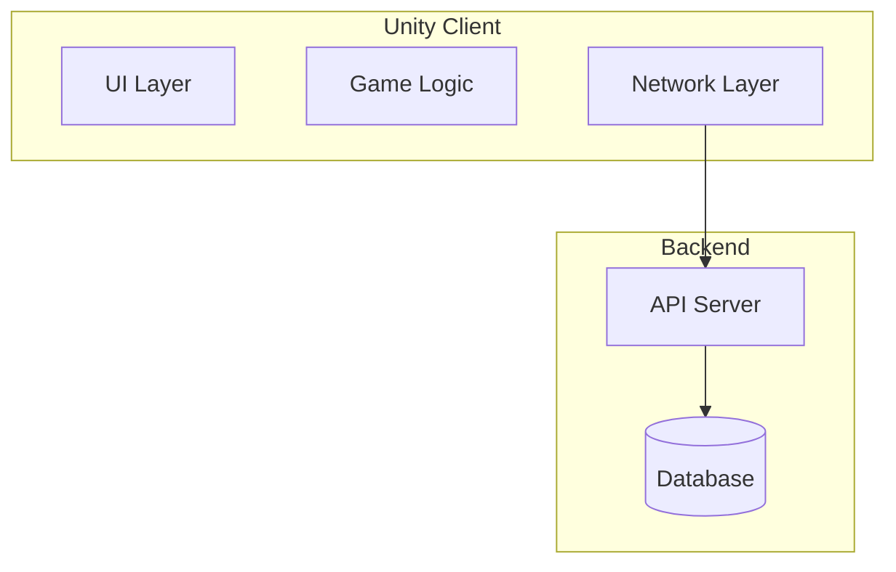
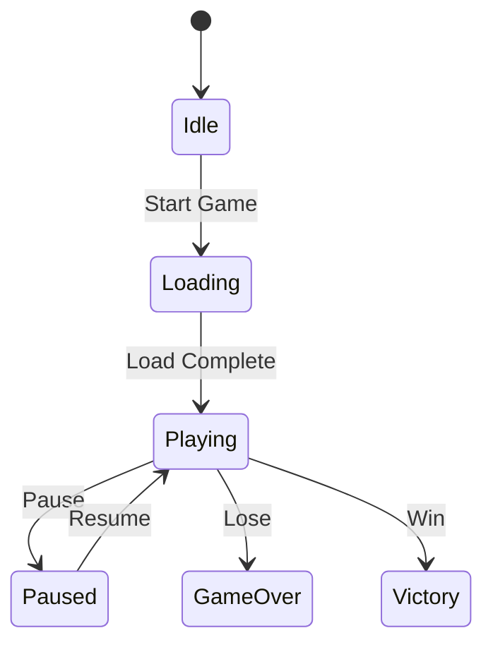

## ドキュメント作成ガイドライン

### 基本原則

- 簡潔性と完全性のバランスを保つ（通常2-10ページ程度）
- 曖昧な表現を避け、具体的に記述する
- 図表やコード例を活用して理解を促進する
- 読者が理解しやすいよう、概要から詳細へ段階的に説明する

### ドキュメント種類と構成

プロジェクトで使用する主要なドキュメントの種類と、それぞれの目的・構成要素を以下に示します。詳細なテンプレートは、プロジェクトの`docs/templates/`ディレクトリを参照してください。

#### デザインドキュメント

**目的**: 実装前に設計の詳細を記述し、チームで合意形成を行う
**主要セクション**:

- 概要（背景・目的）
- Goals and Non-Goals
- 設計（アーキテクチャ、データモデル、API設計）
- 代替案の検討
- セキュリティ・パフォーマンス考慮事項
- テスト計画

**テンプレート**: `docs/templates/design-doc-template.md`

#### 開発環境セットアップガイド

**目的**: 新規メンバーが素早く開発を開始できるようにする
**主要セクション**:

- 前提条件（必要なツール）
- セットアップ手順
- 環境変数の設定
- トラブルシューティング
- 動作確認方法

**テンプレート**: `docs/templates/setup-guide-template.md`

#### Architecture Decision Record (ADR)

**目的**: 重要な技術的決定とその理由を記録する
**主要セクション**:

- ステータス
- コンテキスト
- 検討した選択肢
- 決定内容
- 結果（良い点・悪い点）

**テンプレート**: `docs/templates/adr-template.md`

#### 機能仕様書

**目的**: ユーザー視点での機能要件を明確にする
**主要セクション**:

- 機能概要
- ユーザーストーリー
- 機能要件（必須/オプション）
- UI/UX設計
- エラー処理
- テストケース

**テンプレート**: `docs/templates/feature-spec-template.md`

#### パフォーマンス最適化計画書

**目的**: パフォーマンス改善の戦略と進捗を管理する
**主要セクション**:

- 現状分析（メトリクス、ボトルネック）
- 最適化戦略（フェーズ別）
- 実装詳細
- 計測方法
- リスクと対策

**テンプレート**: `docs/templates/performance-optimization-template.md`

#### API仕様書

**目的**: APIエンドポイントの詳細仕様を定義する
**主要セクション**:

- 概要（ベースURL、認証方式）
- 共通仕様
- エンドポイント一覧
- エラーコード
- 使用例

**テンプレート**: `docs/templates/api-spec-template.md`

#### README.md

**目的**: プロジェクトの概要と基本情報を提供する
**主要セクション**:

- プロジェクト概要
- 主な機能
- 動作環境
- クイックスタート
- プロジェクト構成
- ドキュメントへのリンク

**テンプレート**: `docs/templates/readme-template.md`

#### GitHub関連テンプレート

**プルリクエストテンプレート**: `.github/pull_request_template.md`
**Issueテンプレート（バグ報告）**: `.github/ISSUE_TEMPLATE/bug_report.md`
**Issueテンプレート（機能リクエスト）**: `.github/ISSUE_TEMPLATE/feature_request.md`
**コミットメッセージ規約**: `docs/development/commit-message-guidelines.md`

### テンプレートの管理方法

```
docs/
├── templates/                    # 各種ドキュメントテンプレート
│   ├── design-doc-template.md
│   ├── setup-guide-template.md
│   ├── adr-template.md
│   ├── feature-spec-template.md
│   ├── performance-optimization-template.md
│   ├── api-spec-template.md
│   └── readme-template.md
└── examples/                     # 記入例
    ├── design-doc-example.md
    └── adr-example.md
```

新しいドキュメントを作成する際は、該当するテンプレートをコピーして使用してください：

```bash
# 例：新しいデザインドキュメントを作成
cp docs/templates/design-doc-template.md docs/features/new-feature/design.md
```

### Unity固有の考慮事項

#### 必ず含めるべき情報

- **プラットフォーム対応**: iOS、Android、PC等の差異
- **パフォーマンス目標**: FPS、メモリ使用量、ドローコール数
- **Unity バージョン**: 使用するLTSバージョン
- **依存パッケージ**: 必要なUnity PackageやAsset

#### Unity設計ドキュメントの追加セクション

```markdown
## Unity実装詳細

### Scene構成

- シーン名と役割の一覧

### Prefab設計

- 主要なPrefabの構成と責務

### Assembly Definition構成

- アセンブリの依存関係図

### リソース管理

- Addressablesの使用方針
- メモリ管理戦略
```

### コード例の記述方法

#### 推奨パターンを示す

```csharp
// 推奨: 明確な命名と適切なコメント
public class PlayerMovement : MonoBehaviour
{
    [SerializeField] private float moveSpeed = 5.0f;

    /// <summary>
    /// プレイヤーを指定方向に移動させる
    /// </summary>
    /// <param name="direction">正規化された移動方向</param>
    public void Move(Vector3 direction)
    {
        // 実装
    }
}
```

#### アンチパターンも明示

```csharp
// ❌ 避けるべき: グローバル状態への直接アクセス
public void BadExample()
{
    GlobalState.Instance.playerData = newData; // 避ける
}
```

### 図表の活用

#### Mermaid形式での記述

````markdown
## システム構成


````

#### 状態遷移図

````markdown
## 状態管理


````

### ファイル配置と命名規則

#### ドキュメントの配置

```
docs/
├── architecture/ # システム全体の設計
│ ├── overview.md
│ └── design-decisions/ # ADR (Architecture Decision Records)
├── features/ # 機能別ドキュメント
│ ├── authentication/
│ └── multiplayer/
├── development/ # 開発ガイド
│ ├── setup.md
│ └── coding-standards.md
└── unity-specific/ # Unity固有のドキュメント
├── performance-guide.md
└── asset-guidelines.md
```

### 更新とバージョン管理

#### ドキュメントヘッダー

```markdown
---
title: [ドキュメントタイトル]
version: 1.0.0
last_updated: 2024-03-15
author: @username
tags: [feature, unity, multiplayer]
---
```

#### 変更履歴の記載

```markdown
## 変更履歴

| バージョン | 日付       | 変更内容    | 変更者    |
| ---------- | ---------- | ----------- | --------- |
| 1.0.0      | 2024-03-15 | 初版作成    | @username |
| 1.1.0      | 2024-03-20 | API仕様追加 | @username |
```

### 品質チェックリスト

#### ドキュメント完成時の確認項目

- [ ] 目的と背景が明確に記載されている
- [ ] 技術的な詳細が十分に説明されている
- [ ] 図表やコード例が適切に含まれている
- [ ] Unity固有の考慮事項が記載されている
- [ ] テスト計画が含まれている
- [ ] パフォーマンス要件が明記されている
- [ ] 更新日とバージョンが記載されている