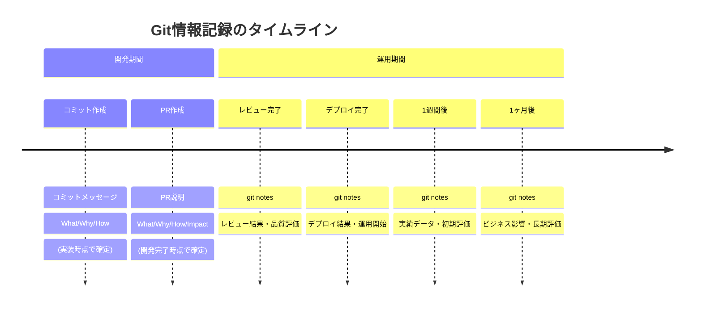
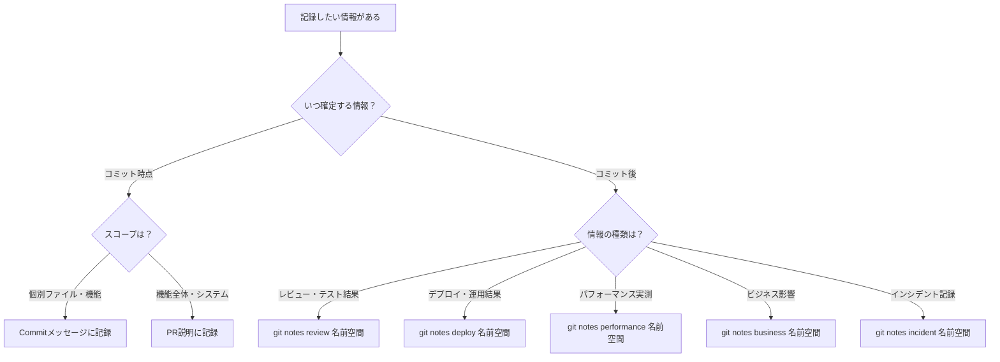

# Git情報分担マッピング

## 概要

このドキュメントでは、Commit、PR、git notesの情報分担を明確化し、What/Why/How/Resultsの各要素をどこに記録すべきかを示します。

## 時系列による情報分担



## 情報要素別マッピング

### What（何を）

| 媒体 | 記録内容 | 詳細レベル | 例 |
|------|----------|------------|-----|
| **Commit** | 個別の変更内容 | ファイル・機能レベル | `JWT認証機能を追加` |
| **PR** | 機能全体の変更 | システム・機能レベル | `JWT認証システムを導入（3コミット含む）` |
| **git notes** | 実際に起こったこと | 結果・影響レベル | `JWT認証導入により15%のパフォーマンス改善` |

### Why（なぜ）

| 媒体 | 記録内容 | 視点 | 例 |
|------|----------|------|-----|
| **Commit** | 技術的理由 | 実装者視点 | `セキュリティ強化のため` |
| **PR** | ビジネス価値・要件 | ステークホルダー視点 | `PCI DSS要件対応とユーザー体験向上のため` |
| **git notes** | 結果の理由・背景 | 評価者視点 | `PCI監査で高評価を得た理由: 暗号化強度とログ管理の充実` |

### How（どのように）

| 媒体 | 記録内容 | 技術レベル | 例 |
|------|----------|------------|-----|
| **Commit** | 実装手法・技術選択 | コードレベル | `jsonwebtoken使用、bcryptでハッシュ化` |
| **PR** | アーキテクチャ・設計判断 | システムレベル | `ステートレス設計、Redis分散キャッシュ採用` |
| **git notes** | 運用でどう動作しているか | 運用レベル | `Redis 99.9%稼働率、水平スケール正常動作` |

### Results（結果）

| 媒体 | 記録内容 | 情報源 |
|------|----------|--------|
| **Commit** | ❌ 記録しない | - |
| **PR** | 予想・計画された結果 | テスト結果・設計予測 |
| **git notes** | ✅ 実際の結果 | 監視データ・ユーザーフィードバック |

## 具体例による情報分担

### 例: JWT認証機能の追加

#### 1. Commit（3つのコミット）

```bash
# Commit 1
git commit -m ":sparkles: JWT基盤ライブラリを追加

セキュリティ要件強化のため
- jsonwebtoken、bcrypt を導入
- トークン生成・検証機能を実装"

# Commit 2  
git commit -m ":sparkles: 認証ミドルウェアを実装

リクエスト処理時の認証チェックのため
- Express ミドルウェアとして実装
- 既存APIとの互換性保持"

# Commit 3
git commit -m ":white_check_mark: JWT認証テストを追加

品質保証とリグレッション防止のため  
- 正常系・異常系テストケース
- カバレッジ95%を達成"
```

#### 2. PR（機能全体）

```markdown
## 概要
JWT認証システムを導入
PCI DSS要件対応とセキュリティ強化のため

## 変更内容
- JWT基盤ライブラリ追加（Commit 1）
- 認証ミドルウェア実装（Commit 2）  
- テストケース追加（Commit 3）

## 技術的詳細
- アーキテクチャ: ステートレス設計
- セキュリティ: OWASP準拠、暗号化強度AES256
- スケーラビリティ: Redis分散キャッシュ対応

## 影響分析
- 既存API: 完全互換性保持
- パフォーマンス: +5ms予想（許容範囲）
- 運用: Redis監視要件追加

## テスト結果  
- 単体テスト: 95%カバレッジ
- セキュリティテスト: 脆弱性検出なし
- 負荷テスト: 1000concurrent正常動作
```

#### 3. git notes（段階的記録）

```bash
# レビュー完了後
git notes add -m "Code Review Results:
Reviewers: @security-team, @senior-dev
Security: ✅ OWASP compliance verified  
Architecture: ✅ Scalable design approved
Test Coverage: ✅ 95% achieved (target: >90%)
Status: Approved for production deployment"

# デプロイ1週間後
git notes add -m "Week 1 Performance Results:
Response Time: 143ms → 128ms (-10.5%)
Memory Usage: +8MB Redis cache (within budget)
Error Rate: 0.01% (target: <0.1%)
User Complaints: 0 (auth-related)
Monitoring: All green, no incidents"

# 1ヶ月後の評価
git notes add -m "Month 1 Business Impact:
Security Audit: ✅ PCI DSS Level 1 achieved
User Experience: Login success rate 99.8%
Support Tickets: -40% (auth-related issues)
Conversion: +3.2% (faster login process)
Tech Debt: Complexity score improved 7.2→6.1"
```

## 情報分担の判断フローチャート



## チーム運用での責任分担

### 役割別責任

| 役割 | Commit | PR | git notes |
|------|--------|----|-----------| 
| **開発者** | ✅ 作成責任 | ✅ 作成責任 | ✅ 技術評価記録 |
| **レビュワー** | - | ✅ レビュー責任 | ✅ レビュー結果記録 |
| **DevOps** | - | - | ✅ デプロイ結果記録 |
| **PO/PM** | - | ✅ ビジネス要件確認 | ✅ ビジネス影響記録 |
| **QA** | - | ✅ テスト要件確認 | ✅ 品質評価記録 |

### タイミング別記録責任

```bash
# 1. 開発時（開発者）
git commit -m "実装内容"
git pr create "機能全体の説明"

# 2. レビュー完了時（レビュワー）
git notes --ref=review add "レビュー結果"

# 3. デプロイ時（DevOps）
git notes --ref=deploy add "デプロイ結果"

# 4. 1週間後（開発者）
git notes --ref=performance add "初期運用結果"

# 5. 1ヶ月後（PO/PM）
git notes --ref=business add "ビジネス影響評価"
```

## 情報品質のガイドライン

### 各媒体での記録品質

#### Commit品質指標
- **明確性**: 変更内容が一読で理解できる
- **具体性**: 実装手法・技術選択が明記
- **簡潔性**: 50文字以内のタイトル
- **一貫性**: gitmoji使用、形式統一

#### PR品質指標  
- **包括性**: 機能全体が漏れなく説明
- **影響分析**: リスク・影響範囲の明記
- **テスト網羅**: 品質保証の証跡
- **レビュアビリティ**: 確認ポイントの明示

#### git notes品質指標
- **客観性**: 数値・事実ベースの記録
- **追跡可能性**: 関連情報へのリンク
- **時系列整理**: 記録日時の明記
- **アクション指向**: 次のステップの提示

## 運用改善のためのメトリクス

### 測定指標

```bash
# 記録品質の測定
echo "Commit quality score: $(git log --oneline | grep -E '^[a-f0-9]{7} :' | wc -l) / $(git log --oneline | wc -l)"

# PR説明の充実度
echo "PR completion rate: $(gh pr list --state merged --json body | jq '[.[] | select(.body | length > 500)] | length') / $(gh pr list --state merged --json number | jq 'length')"

# git notes記録率
echo "Notes coverage: $(git notes list | wc -l) / $(git log --oneline | wc -l)"
```

### 改善アクション

- **週次**: 情報記録品質レビュー
- **月次**: 運用メトリクス確認・改善
- **四半期**: ワークフロー全体の見直し

---

この情報分担により、開発から運用まで一貫した情報管理が可能になり、プロジェクトの透明性と改善サイクルが向上します。