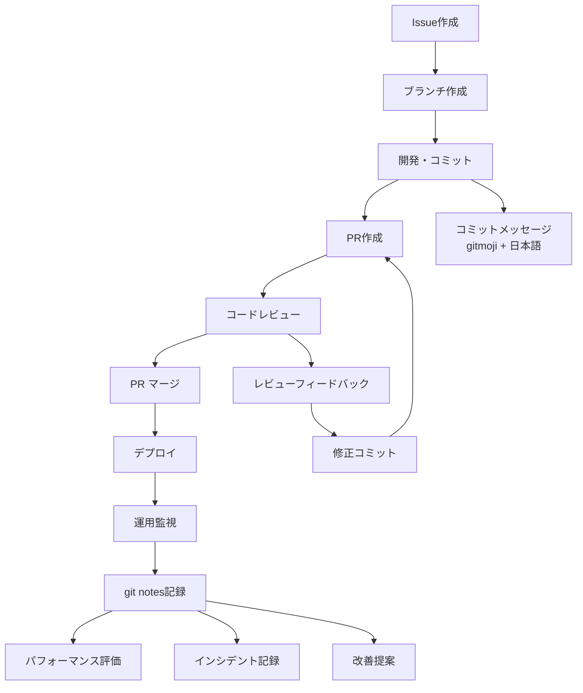

# Git 開発ワークフロー統合ガイド

## 概要

このドキュメントは commit、PR、git notes を統合した開発ワークフローの全体像を示します。

## 開発フロー全体図



## フェーズ別詳細ガイド

### Phase 1: 計画・準備

#### Issue 作成
```markdown
# Issue テンプレート
## 概要
機能/バグの概要説明

## 背景・目的
なぜこの変更が必要か

## 受け入れ条件
- [ ] 条件1
- [ ] 条件2

## 技術的考慮事項
- パフォーマンス影響
- セキュリティ要件
- 互換性
```

#### ブランチ戦略
```bash
# 命名規則
feature/ISSUE-123-user-authentication
bugfix/ISSUE-456-login-memory-leak
hotfix/critical-security-patch
release/v1.2.0

# ブランチ作成
git checkout -b feature/ISSUE-123-user-auth
```

### Phase 2: 開発・コミット

#### コミット作成ワークフロー
```bash
# 1. 変更内容確認
git status
git diff

# 2. 段階的ステージング
git add src/auth/
git status

# 3. コミットメッセージ作成（gitmoji + 日本語）
git commit -m "$(cat <<'EOF'
:sparkles: JWT認証基盤を実装

- トークン生成・検証機能
- ミドルウェア統合
- セキュリティ強化
EOF
)"

# 4. 継続的な小さなコミット
git add tests/
git commit -m ":white_check_mark: JWT認証のテストケースを追加"
```

#### コミット粒度の指針
- **1つの論理的変更** = 1つのコミット
- **独立してビルド可能**
- **レビューしやすいサイズ**

### Phase 3: プルリクエスト

#### PR作成チェックリスト
```bash
# 事前確認
- [ ] 全テスト通過
- [ ] Lint エラーなし
- [ ] 機密情報含まず
- [ ] 関連ファイルのみ含む

# PR作成
gh pr create --title "feat: JWT認証機能の追加" --body "$(cat <<'EOF'
## 概要
セキュリティ強化のため JWT 認証を導入

## 変更内容  
- JWT 基盤実装（3 commits）
- 認証ミドルウェア追加
- フロントエンド連携

## テスト
- [x] 単体テスト: 95% カバレッジ
- [x] 統合テスト: 全シナリオ通過
- [x] セキュリティテスト: 脆弱性なし

## レビューポイント
- JWT実装のセキュリティ要件
- パフォーマンス影響評価
EOF
)"
```

#### レビュープロセス
1. **自動チェック**: CI/CD パイプライン
2. **ピアレビュー**: コード品質・設計
3. **セキュリティレビュー**: 要件に応じて
4. **最終承認**: テックリード・シニア

### Phase 4: マージ・デプロイ

#### マージ戦略の選択
```bash
# 通常の機能追加: Squash and Merge
# → クリーンな履歴、コミットメッセージ統一

# 重要な機能: Merge Commit  
# → 完全な開発履歴保持

# 小さな修正: Rebase and Merge
# → 直線的な履歴維持
```

#### デプロイフロー
```bash
# 1. マージ後の自動デプロイ
main branch → CI/CD → staging → production

# 2. デプロイ確認
- 機能動作確認
- パフォーマンス監視
- エラーログ確認
```

### Phase 5: 運用・フィードバック

#### git notes による記録
```bash
# デプロイ直後
git notes add <commit-hash> -m "Deploy Status:
Environment: production
Time: $(date)
Status: Success
Monitoring: All green"

# 1週間後の評価
git notes add <commit-hash> -m "Performance Review:
Response time: 15% improvement
Error rate: 0.01% (target: <0.1%)
User feedback: Positive
Memory usage: Within limits"

# インシデント発生時
git notes add <commit-hash> -m "Production Issue:
Issue: High memory usage detected
Impact: 5% performance degradation  
Resolution: Config tuning applied
Monitor: Alert threshold adjusted
Related: incident-2024-0115"
```

## ツール統合

### 自動化スクリプト例

#### コミット支援
```bash
#!/bin/bash
# commit-helper.sh

echo "変更内容を確認しています..."
git status
git diff --staged

echo "適切な gitmoji を選択してください:"
echo "1. :sparkles: 新機能"
echo "2. :bug: バグ修正"
echo "3. :recycle: リファクタリング"
read -p "選択 (1-3): " choice

case $choice in
    1) emoji=":sparkles:" ;;
    2) emoji=":bug:" ;;
    3) emoji=":recycle:" ;;
esac

read -p "コミットメッセージ: " message
git commit -m "$emoji $message"
```

#### PR作成支援
```bash
#!/bin/bash
# pr-helper.sh

echo "PR 作成前チェック..."
git diff main...HEAD --name-only
git log main..HEAD --oneline

echo "全テストが通過していることを確認してください"
read -p "続行しますか? (y/n): " confirm

if [ "$confirm" = "y" ]; then
    gh pr create --web
fi
```

### CI/CD パイプライン統合

```yaml
# .github/workflows/main.yml
name: CI/CD Pipeline

on:
  pull_request:
    branches: [main]
  push:
    branches: [main]

jobs:
  test:
    runs-on: ubuntu-latest
    steps:
      - uses: actions/checkout@v3
      - name: Run tests
        run: npm test
      
      - name: Add test results to git notes
        if: github.ref == 'refs/heads/main'
        run: |
          git notes add -m "CI Results:
          Build: ${{ job.status }}
          Tests: ${{ steps.test.outcome }}
          Coverage: $(npm run coverage | tail -1)
          Duration: ${{ job.duration }}"
          git push origin refs/notes/*
```

## 品質指標・KPI

### 開発効率指標
- **Lead Time**: Issue作成 → 本番デプロイ
- **Cycle Time**: PR作成 → マージ
- **PR Size**: 平均変更行数、レビュー時間
- **Commit Quality**: リバート率、修正コミット率

### 品質指標
- **Code Coverage**: テストカバレッジ率
- **Defect Rate**: 本番バグ発生率
- **Review Effectiveness**: レビューで発見された問題数
- **Documentation Ratio**: git notes 記録率

### 運用指標
- **MTTR**: 平均修復時間
- **Deployment Frequency**: デプロイ頻度
- **Change Failure Rate**: 失敗デプロイ率
- **Performance Impact**: 各変更のパフォーマンス影響

## トラブルシューティング

### よくある問題と対策

#### コミット関連
```bash
# 間違ったコミットメッセージ
git commit --amend -m "正しいメッセージ"

# コミット取り消し
git reset --soft HEAD~1

# ファイル追加忘れ
git add missing-file.js
git commit --amend --no-edit
```

#### PR関連
```bash
# コンフリクト解決
git fetch origin main
git rebase origin/main
# コンフリクト解決後
git push --force-with-lease

# PR分割が必要な場合
git rebase -i HEAD~3  # 対話的リベース
# または新しいブランチで分割
```

#### git notes関連
```bash
# ノート衝突解決
git notes merge origin/notes/commits

# 誤ったノート削除
git notes remove <commit-hash>
git notes add <commit-hash> -m "正しい内容"
```

## ベストプラクティス

### Do's ✅
- **小さく頻繁な**コミット
- **明確で簡潔な**コミットメッセージ
- **包括的な**PR説明
- **迅速な**レビューレスポンス
- **継続的な**git notes記録

### Don'ts ❌
- **大きすぎる**PR（400行超）
- **曖昧な**コミットメッセージ
- **テスト不足**での PR作成
- **機密情報**のコミット
- **ノート記録**の忘れ

### チームルール例
```markdown
## 開発チーム合意事項

### コミット
- gitmoji 必須使用
- 日本語メッセージ
- 1コミット = 1機能単位

### PR
- 24時間以内初回レビュー
- 2名以上の承認必須
- 全CI通過必須

### 運用
- デプロイ後1週間以内にgit notes記録
- 月次でワークフロー改善検討
```

## 関連ドキュメント

- [commit.md](./commit.md) - コミットメッセージ詳細ガイド
- [pr.md](./pr.md) - プルリクエスト詳細ガイド  
- [note.md](./note.md) - git notes 詳細ガイド

---

このワークフローは継続的に改善していくものです。チームの状況に応じてカスタマイズしてください。