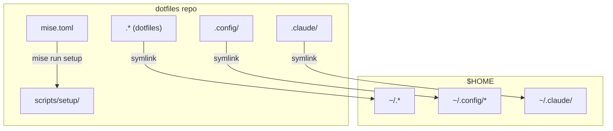
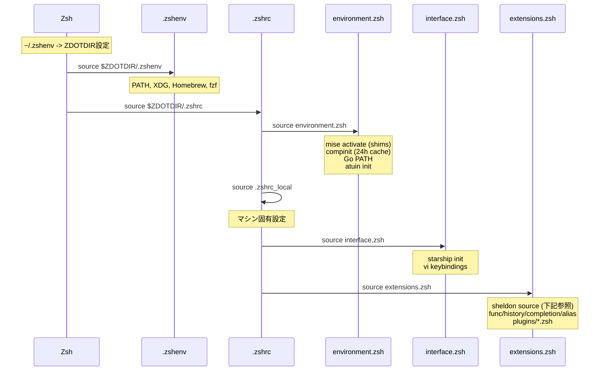
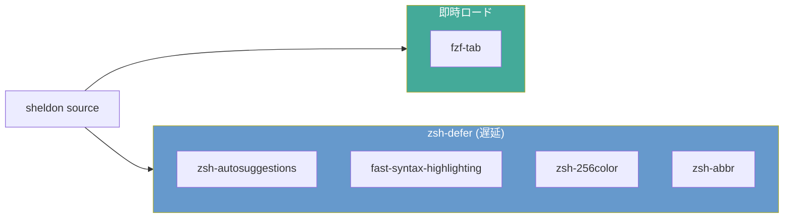
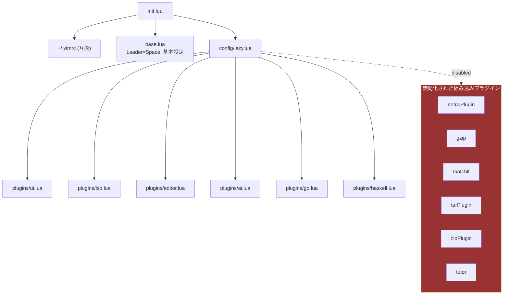
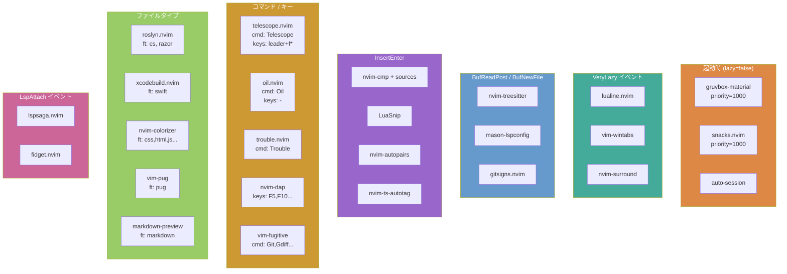
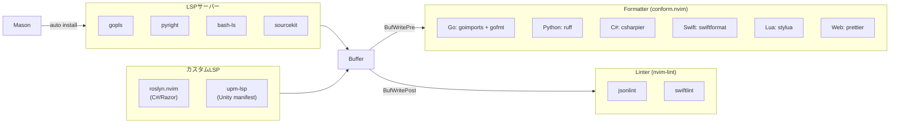
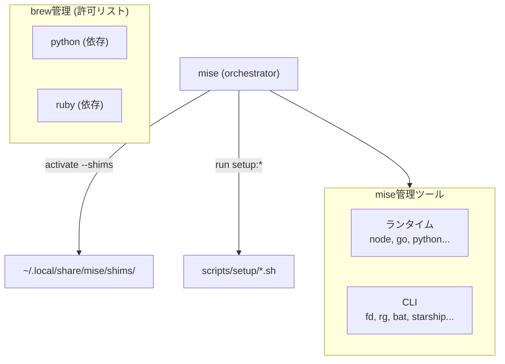

# dotfiles Architecture

## 全体構成

## Zsh 起動シーケンス

sheldon + zsh-defer による遅延ロードで起動を高速化している。

## sheldon プラグインの遅延ロード

## Neovim 起動フロー

## Neovim プラグイン遅延ロード戦略

lazy.nvim のイベント/コマンド/キー/ファイルタイプによる遅延ロード。

## LSP 構成

## ツール管理レイヤー

