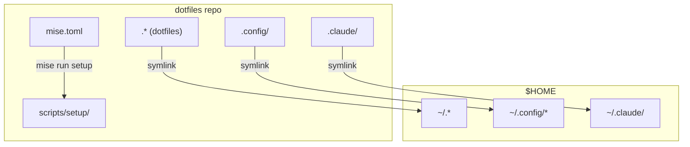
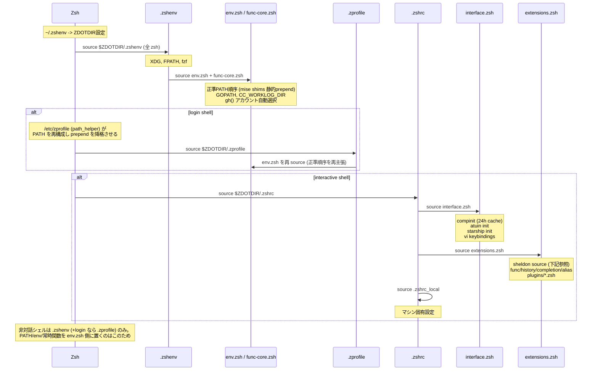
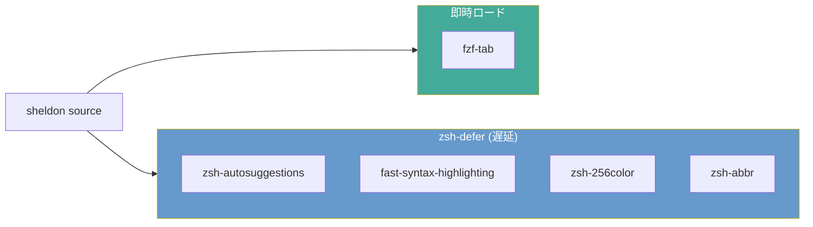
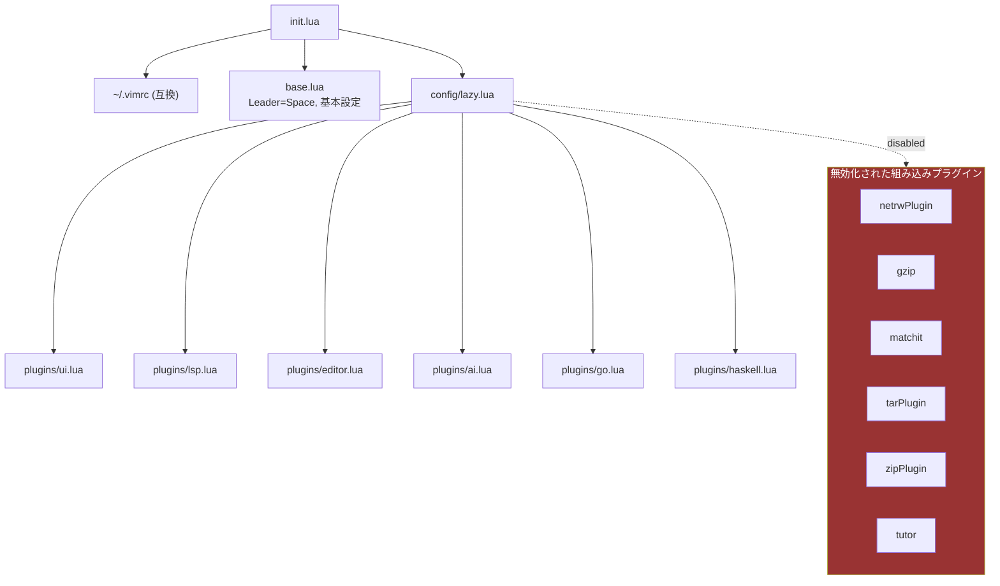
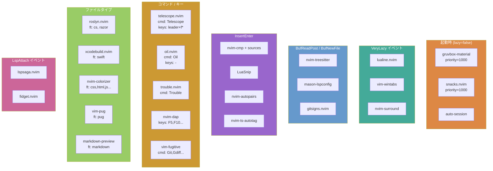
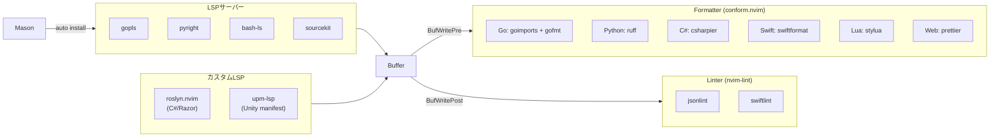
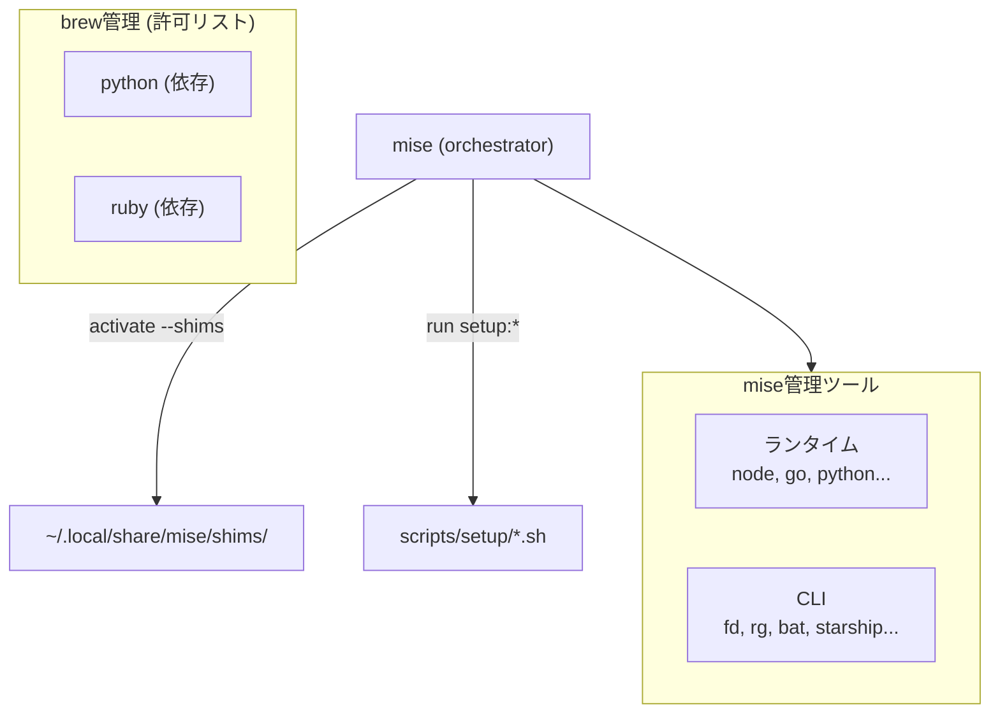
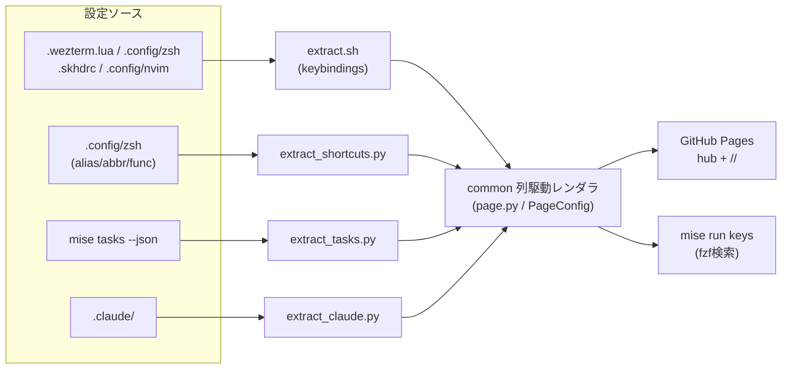
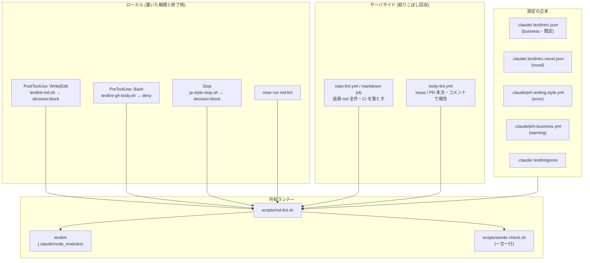

# dotfiles Architecture

## 全体構成

```mermaid
graph TB
    subgraph dotfiles["dotfiles repo"]
        root[".* (dotfiles)"]
        config[".config/"]
        claude[".claude/"]
        scripts["scripts/setup/"]
        mise["mise.toml"]
    end

    subgraph home["$HOME"]
        home_dots["~/.*"]
        home_config["~/.config/*"]
        home_claude["~/.claude/"]
    end

    root -->|symlink| home_dots
    config -->|symlink| home_config
    claude -->|symlink| home_claude
    mise -->|"mise run setup"| scripts
```

## Zsh 起動シーケンス

sheldon + zsh-defer による遅延ロードで起動を高速化している。

```mermaid
sequenceDiagram
    participant Shell as Zsh
    participant Env as .zshenv
    participant Core as env.zsh / func-core.zsh
    participant Prof as .zprofile
    participant RC as .zshrc
    participant UI as interface.zsh
    participant Ext as extensions.zsh

    Note over Shell: ~/.zshenv -> ZDOTDIR設定
    Shell->>Env: source $ZDOTDIR/.zshenv (全 zsh)
    Note over Env: XDG, FPATH, fzf
    Env->>Core: source env.zsh + func-core.zsh
    Note over Core: 正準PATH順序 (mise shims 静的prepend)<br/>GOPATH, CC_WORKLOG_DIR<br/>gh() アカウント自動選択

    alt login shell
        Note over Shell: /etc/zprofile (path_helper) が<br/>PATH を再構成し prepend を降格させる
        Shell->>Prof: source $ZDOTDIR/.zprofile
        Prof->>Core: env.zsh を再 source (正準順序を再主張)
    end

    alt interactive shell
        Shell->>RC: source $ZDOTDIR/.zshrc
        RC->>UI: source interface.zsh
        Note over UI: compinit (24h cache)<br/>atuin init<br/>starship init<br/>vi keybindings
        RC->>Ext: source extensions.zsh
        Note over Ext: sheldon source (下記参照)<br/>func/history/completion/alias<br/>plugins/*.zsh
        RC->>RC: source .zshrc_local
        Note over RC: マシン固有設定
    end

    Note over Shell: 非対話シェルは .zshenv (+login なら .zprofile) のみ。<br/>PATH/env/常時関数を env.zsh 側に置くのはこのため
```

## sheldon プラグインの遅延ロード

```mermaid
graph LR
    subgraph immediate["即時ロード"]
        fzf_tab["fzf-tab"]
    end

    subgraph deferred["zsh-defer (遅延)"]
        auto["zsh-autosuggestions"]
        syntax["fast-syntax-highlighting"]
        color["zsh-256color"]
        abbr["zsh-abbr"]
    end

    sheldon["sheldon source"] --> immediate
    sheldon --> deferred

    style immediate fill:#4a9,color:#fff
    style deferred fill:#69c,color:#fff
```

## Neovim 起動フロー

```mermaid
graph TD
    init["init.lua"] --> vimrc["~/.vimrc (互換)"]
    init --> base["base.lua<br/>Leader=Space, 基本設定"]
    init --> lazy["config/lazy.lua"]

    lazy --> ui["plugins/ui.lua"]
    lazy --> lsp["plugins/lsp.lua"]
    lazy --> editor["plugins/editor.lua"]
    lazy --> ai["plugins/ai.lua"]
    lazy --> go["plugins/go.lua"]
    lazy --> haskell["plugins/haskell.lua"]

    subgraph disabled_builtin["無効化された組み込みプラグイン"]
        netrw["netrwPlugin"]
        gzip["gzip"]
        matchit["matchit"]
        tar["tarPlugin"]
        zip["zipPlugin"]
        tutor["tutor"]
    end

    lazy -.->|disabled| disabled_builtin

    style disabled_builtin fill:#933,color:#fff
```

## Neovim プラグイン遅延ロード戦略

lazy.nvim のイベント/コマンド/キー/ファイルタイプによる遅延ロード。

```mermaid
graph TB
    subgraph startup["起動時 (lazy=false)"]
        gruvbox["gruvbox-material<br/>priority=1000"]
        snacks["snacks.nvim<br/>priority=1000"]
        session["auto-session"]
    end

    subgraph very_lazy["VeryLazy イベント"]
        lualine["lualine.nvim"]
        wintabs["vim-wintabs"]
        surround["nvim-surround"]
    end

    subgraph buf_read["BufReadPost / BufNewFile"]
        treesitter["nvim-treesitter"]
        mason_lsp["mason-lspconfig"]
        gitsigns["gitsigns.nvim"]
    end

    subgraph insert["InsertEnter"]
        cmp["nvim-cmp + sources"]
        luasnip["LuaSnip"]
        autopairs["nvim-autopairs"]
        autotag["nvim-ts-autotag"]
    end

    subgraph cmd_key["コマンド / キー"]
        telescope["telescope.nvim<br/>cmd: Telescope<br/>keys: leader+f*"]
        oil["oil.nvim<br/>cmd: Oil<br/>keys: -"]
        trouble["trouble.nvim<br/>cmd: Trouble"]
        dap["nvim-dap<br/>keys: F5,F10..."]
        fugitive["vim-fugitive<br/>cmd: Git,Gdiff..."]
    end

    subgraph ft["ファイルタイプ"]
        roslyn["roslyn.nvim<br/>ft: cs, razor"]
        xcode["xcodebuild.nvim<br/>ft: swift"]
        colorizer["nvim-colorizer<br/>ft: css,html,js..."]
        pug["vim-pug<br/>ft: pug"]
        mdpreview["markdown-preview<br/>ft: markdown"]
    end

    subgraph lsp_attach["LspAttach イベント"]
        lspsaga["lspsaga.nvim"]
        fidget["fidget.nvim"]
    end

    style startup fill:#d84,color:#fff
    style very_lazy fill:#4a9,color:#fff
    style buf_read fill:#69c,color:#fff
    style insert fill:#96c,color:#fff
    style cmd_key fill:#c93,color:#fff
    style ft fill:#9c6,color:#fff
    style lsp_attach fill:#c69,color:#fff
```

## LSP 構成

```mermaid
graph LR
    mason["Mason"] -->|auto install| tools

    subgraph tools["LSPサーバー"]
        gopls
        pyright
        bash_ls["bash-ls"]
        sourcekit
    end

    subgraph custom["カスタムLSP"]
        roslyn["roslyn.nvim<br/>(C#/Razor)"]
        upm["upm-lsp<br/>(Unity manifest)"]
    end

    subgraph format["Formatter (conform.nvim)"]
        go_fmt["Go: goimports + gofmt"]
        py_fmt["Python: ruff"]
        cs_fmt["C#: csharpier"]
        swift_fmt["Swift: swiftformat"]
        lua_fmt["Lua: stylua"]
        web_fmt["Web: prettier"]
    end

    subgraph lint["Linter (nvim-lint)"]
        jsonlint
        swiftlint
    end

    tools --> buf["Buffer"]
    custom --> buf
    buf -->|BufWritePre| format
    buf -->|BufWritePost| lint
```

## ツール管理レイヤー

```mermaid
graph TD
    mise["mise (orchestrator)"] -->|"activate --shims"| shims["~/.local/share/mise/shims/"]
    mise -->|"run setup:*"| setup["scripts/setup/*.sh"]

    subgraph managed["mise管理ツール"]
        direction LR
        runtime["ランタイム<br/>node, go, python..."]
        cli["CLI<br/>fd, rg, bat, starship..."]
    end

    mise --> managed

    subgraph brew_only["brew管理 (許可リスト)"]
        python_dep["python (依存)"]
        ruby_dep["ruby (依存)"]
    end

```

## リファレンスハブ

詳細は [reference.md](reference.md)。
1つの列駆動レンダラ（`scripts/reference/common/`）を4ドメインで共有する。

```mermaid
flowchart LR
    subgraph sources["設定ソース"]
        kb[".wezterm.lua / .config/zsh<br/>.skhdrc / .config/nvim"]
        sc[".config/zsh<br/>(alias/abbr/func)"]
        tk["mise tasks --json"]
        cl[".claude/"]
    end

    kb --> ekb["extract.sh<br/>(keybindings)"]
    sc --> esc["extract_shortcuts.py"]
    tk --> etk["extract_tasks.py"]
    cl --> ecl["extract_claude.py"]

    ekb & esc & etk & ecl --> render["common 列駆動レンダラ<br/>(page.py / PageConfig)"]
    render --> pages["GitHub Pages<br/>hub + /<domain>/"]
    render --> fzf["mise run keys<br/>(fzf検索)"]
```

## Markdown 文体検査

`.claude/rules/writing-style.md` の規範のうち、静的に検査できる部分を textlint に移した層。
検出は決定論的な textlint が担い、修正は文脈を読める LLM が担う。

設定の正本は `.claude/.textlintrc.json` と 2 つの prh 辞書（`.claude/prh-writing-style.yml`・`.claude/prh-business.yml`）。
prh 辞書には既製プリセットに無い規範を入れている（em ダッシュ接続・`Phase N`・執筆時系列・曖昧語・空虚な強調・LLM 特有の空語）。
辞書は誤検知の実測で 2 段に分けてある。
人が書いた md で 0 件だったパターンだけを `prh-writing-style.yml` に error として置き、機械では黒と断定できない語は `prh-business.yml` に warning として置く。
warning は exit code を変えないため CI と PR は落ちないが、書いた直後の hook には届く。
textlint は同じルール id を 1 つしか持てないので、2 つ目の辞書は package 名 `textlint-rule-prh` を key にした別インスタンスとして読ませている。
一文一行は `scripts/sembr-check.sh` が別途見る。
箇条書き項目にも発火してしまう textlint-rule-one-sentence-per-line は規範と衝突するため使わない。

文体プロファイルは環境変数 `JA_STYLE_SCENE` で切り替える。
既定の business は業務・技術文書向けで、`JA_STYLE_SCENE=novel` は `.claude/.textlintrc.novel.json` を使う。
小説では長い一文・反復・誇張が技法なので、それらを見るルールと prh 辞書を落とし、表記の壊れ（半角カナ・NFD・対応しない括弧）だけを残す。
一文一行も diff を読みやすくするための文書の規約なので、novel では走らせない。

`scripts/md-lint.sh` が唯一の実行経路で、mise task・CI・3 つの hook すべてがここを通る。
手元と CI で結果が食い違わないようにするための集約点。

```mermaid
flowchart TB
    subgraph canon["設定の正本"]
        rc[".claude/.textlintrc.json<br/>(business・既定)"]
        rcn[".claude/.textlintrc.novel.json<br/>(novel)"]
        prh[".claude/prh-writing-style.yml<br/>(error)"]
        prhb[".claude/prh-business.yml<br/>(warning)"]
        ign[".claude/.textlintignore"]
    end

    subgraph runner["共有ランナー"]
        ml["scripts/md-lint.sh"]
        tl["textlint<br/>(.claude/node_modules)"]
        sb["scripts/sembr-check.sh<br/>(一文一行)"]
        ml --> tl
        ml --> sb
    end

    canon --> ml

    subgraph local["ローカル (書いた瞬間と終了時)"]
        h1["PostToolUse: Write|Edit<br/>textlint-md.sh → decision:block"]
        h2["PreToolUse: Bash<br/>textlint-gh-body.sh → deny"]
        h3["Stop<br/>ja-style-stop.sh → decision:block"]
        mt["mise run md:lint"]
    end

    subgraph server["サーバサイド (取りこぼし回収)"]
        ci["repo-lint.yml / markdown job<br/>追跡 md 全件・CI を落とす"]
        bl["body-lint.yml<br/>Issue / PR 本文・コメントで報告"]
    end

    h1 --> ml
    h2 --> ml
    h3 --> ml
    mt --> ml
    ci --> ml
    bl --> ml
```

hook はユーザスコープ（`~/.claude/settings.json`）に登録するため、dotfiles 以外のプロジェクトでも動く。
`~/.claude/hooks` が dotfiles へのシンボリックリンクなので、hook は自分の実体パスから repo とランナーを解決できる。

3 つ目の hook は Stop に置いてある。
`ja-style-stop.sh` は、そのセッションで PostToolUse が検査した md だけを再検査する。
差し戻し上限に達して通過した指摘や、あとから別のファイルへ混入した指摘を、終了前にもう一度拾う。
全件走査はしない。
触ったパスは `${TMPDIR}/claude-textlint/<session_id>/` に記録してある。

md を書く hook と body の hook はプロジェクト設定の扱いが違う。

| hook | 自前の `.textlintrc*` を持つプロジェクトでの挙動 | 理由 |
| --- | --- | --- |
| `textlint-md.sh` | 譲って何もしない | md はその repo の成果物なので、repo の規範が正 |
| `textlint-gh-body.sh` | 譲らず個人の規範を当てる | repo の設定はファイルを統べるもので、GitHub 上の本文は管轄しない |

サーバサイドの `body-lint.yml` はこのリポジトリでしか動かない。
GitHub Actions は自分のリポジトリのイベントにしか反応しないため、他リポジトリの Issue / PR 本文は
ローカルの `textlint-gh-body.sh` だけが見る。

安全弁は 3 つ。
同一ファイルへの差し戻しは既定 2 回まで、textlint が無い環境ではフェイルオープン、`CLAUDE_TEXTLINT_DISABLE=1` で無効化できる。

`--fix` は使わない。
prh の `expected` はリライト方針のヒントであって置換文字列ではないため、自動修正すると文章が壊れる。

エージェント向けプロンプト（`.apm/agents/`、`.claude/commands/`、`.claude/output-styles/`、`.claude/tools/`）は
`.textlintignore` で除外する。
`- **ラベル**: 説明` を意図的に使うため、人間向け散文の規範を当てても直す意味がない。
一文一行だけは除外を受けず全 md に適用する。
